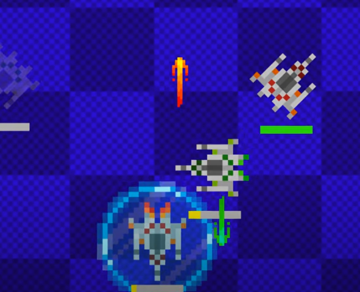

# 1st Annual Makerchip ASIC Design Showdown, 2025

# Overview

This repository is all you need to compete in the 1st Annual Makerchip ASIC Design Showdown. For Showdown details, see https://www.redwoodeda.com/showdown-info. Participants must monitor the `#showdown` channel in the [TL-Verilog User's Slack workspace](https://join.slack.com/t/tl-verilog-users/shared_invite/zt-4fatipnr-dmDgkbzrCe0ZRLOOVm89gA) for program updates.

In each match, your fleet of three ships battles another. You design the control circuitry for your autonomous spacecraft to outmaneuver and outwit your opponents'.

## Rules of Combat

Your three ships can:

- accelerate
- fire up, down, left, or right
- activate a shield
- activate cloaking

Each ship has a recharging energy supply. Each action costs energy. You might take an offensive strategy, firing often; you might take a defensive strategy, leaning heavily on your shields and cloaking; or you might focus on maneuverability. Your strategy is what sets you apart from your competition.

Your ships are able to monitor the positions of the other ships (unless cloaked) and whether they are cloaked. They know which ships have been destroyed (on both teams). They cannot see enemy bullets or shields.

Ships are destroyed when they are shot or when their hit box exits the play area.

Control circuits have inputs characterizing the visible state of the system, and they provide outputs that affect this state on the next cycle. Acceleration is applied as an instantaneous burst that immediately affects velocity, which affects the position on the next cycle. The VIZ tab on a given cycle reflects the state as updated by the inputs on that cycle.

The coordinate system is flipped 180 degrees between the opponents, around (0, 0) in the center, so the starting ship coordinates are the same for both opponents. The X dimension increases to the right, and the Y dimension increases upward.

Ships are numbered 0, 1, 2 and have energy bars colored yellow, green, and blue, respectively. Players/teams are red and green, corresponding to 0 and 1 in the code, and, in VIZ, 1 and 2.

Other game parameters like hit box and board sizes can be found at the top of `showdown_lib.tlv`.

## Coding Your Control Circuits

You'll construct your control logic in a copy of either:

- For TL-Verilog: `showdown_template.tlv` [[open in Makerchip](https://www.makerchip.com/sandbox?code_url=https%3A%2F%2Fraw.githubusercontent.com%2Frweda%2Fshowdown-2025-space-battle%2Frefs%2Fheads%2Fmain%2Fshowdown_template.tlv)]
- For plain old SystemVerilog: `showdown_verilog_template.tlv` [[open in Makerchip](https://www.makerchip.com/sandbox?code_url=https%3A%2F%2Fraw.githubusercontent.com%2Frweda%2Fshowdown-2025-space-battle%2Frefs%2Fheads%2Fmain%2Fshowdown_verilog_template.tlv)]

Comments in those files provide interface signal details. All you need is the one file in GitHub for submission. We suggest, using the green "Use this template" button from [this repository](https://github.com/rweda/showdown-2025-space-battle). Clone your new Showdown repository for local editing. Copy a template file into a new `.tlv` file in this repo for you work. (Alternatively, you could fork the repo and edit directly in the template file so you can pull future changes.)

Edit your local file in Makerchip (supported by Chrome and Edge) with auto-save. Or edit in your favorite editor, and compile in Makerchip by using "Project" > "Connect File".

## Walkthrough/Promo Video

## Should I use TL-Verilog or Verilog?

It's up to you. Possible reasons to use pure Verilog inlcude:

- *Familiarity:* You likely have experience with Verilog; not too many folks are experienced with the TL-Verilog language extensions yet.
- *AI Assistance:* LLMs understand Verilog far better than TL-Verilog today.
- *Googleability:* There's a world of information about Verilog, while TL-Verilog learning materials are limited.
- *Marketable Skills:* Employers generally look for Verilog experience today since they don't know better.

On the other hand, TL-Verilog offers:

- *Superior Capabilities:* TL-Verilog is much more powerful and simpler. You can do more with less.
- *Easier:* You can become comfortable with it in a week. Especially, if you don't already know Verilog, it can be easier to get going with TL-Verilog. Even if you know Verilog already, you'll probably make up for your one-week investment by the time you are finished coding.
- *Advanced Skills:* Use this contest as an opportunity to learn something new and amp up your game.
- *Differentiation:* While mainstream employers look for Verilog designers, employers who are on the forefront of technology value advance skills with differentiated technology. Learning TL-Verilog could help you reach these employers and differentiate yourself from the masses.
- *Community:* This contest is associated with the TL-Verilog community. In the `#showdown` Slack channel in the [TL-Verilog User's Slack workspace](https://join.slack.com/t/tl-verilog-users/shared_invite/zt-4fatipnr-dmDgkbzrCe0ZRLOOVm89gA) you'll find a supportive community around TL-Verilog.
- *IDE Features:* This contest uses the Makerchip IDE, which is custom built to support TL-Verilog. Features like the DIAGRAM view and interactive features apply only to TL-Verilog.
- *Compatibility:* If you are on the fence, start with the TL-Verilog template and try using TL-Verilog. It is an extension of Verilog. If you have trouble, you can always write a pure Verilog component (module, macro, function, etc.) and instantiate it from your TL-Verilog code.

## Tips

### TL-Verilog

In the WAVEFORM viewer and DIAGRAM, using the template, your signals will appear under `TLV/secret/team0` or `/secret/team1`. You'll also see signals from the Showdown framework, but your logic must not access them. They will be renamed for the final competition to ensure compliance. Non-compliant submissions will be disqualified.

Spend the time to learn TL-Verilog first, if you are not already familiar. There are learning resources in the Makerchip IDE. For this competition, you can build reasonable circuits as combinational logic, so pipelines, sequential logic, "alignment", and states are likely unimportant. Hierarchy will be useful to learn. Other tutorial topics, validity, TLV macros, and transaction flow, though they may be used heavily by the Showdown library and template, are less important for your logic.

If you don't know Verilog syntax, TL-Verilog uses Verilog expression (`assign`) syntax, so you should learn this as well.

Some specific notes:

- To treat TL-Verilog signals (pipesignals) as signed, use `\$signed($my_sig)`.
- Ternary expressions are king in TL-Verilog. Make sure you understand how to use and format them cleanly. Use them to customize behavior based on `#ship` among other uses.

### Verilog

In the WAVEFORM viewer, you can find your signals under `SV.team_YOUR_GITHUB_ID` (which you must rename accordingly). Sadly, the DIAGRAM will be of no use to you.

The internet can help you learn Verilog.

To take advantage of LLM coding, connect Makerchip to an external file ("Project"::"Connect File" menu) and use and editor with an LLM assistant, like GitHub Copilot.

### Debugging

Assert `*passed` and/or `*failed` using, e.g., ` || *cyc_cnt > 50`, to limit simulation for testing.

### VIZ

Contestants are encouraged to use VIZ for debugging. Documentation is available in the Makerchip IDE. Custom VIZ features, however should be disabled in your final submission. Obstructive VIZ may result in disqualification.

### Seeking Help

Seek help in Slack. Help others. A bit of competition can add to the fun, but the spirit of the competition is collaboration and community building.

## Competition Rules

The Makerchip platform is the judge and jury for battles. The winner of each battle is the player/team who destroys all enemy ships or has the most ships remaining at (roughly) Makerchip's cycle limit of ~600 cycles. Submissions that fail to compile and simulate within Makerchip's timeout will not be able to compete. Battles that fail to compile/simulate will be deemed a tie or awarded to the team that was not responsible for the failure. Details of the tournament structure will be determined close to the competition date, depending upon participation.

Your submission must be based on the latest Verilog or TL-Verilog template and must not reference signals outside of your control circuit and its inputs/outputs. Bug fixes in the templates and Showdown library may be required during the coding period. Rule changes will not be introduced lightly, but may be deemed necessary to facilitate the best experience and would be communicated in Slack. Be sure you are receiving Slack notifications.

Inconsiderate behavior will not be tolerated and may result in disqualification. In the event of disputes, ambiguity, library/template bugs affecting outcomes, disqualification, etc., Redwood EDA, LLC's decisions are final and may result in loss of prize money. Details can be found in the [Showdown Terms and Conditions](https://www.redwoodeda.com/showdown-terms).
